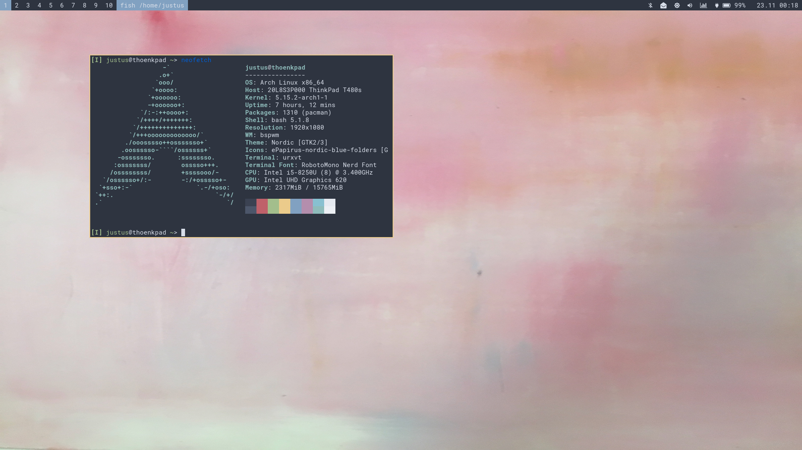

# My Dotfiles

These are my dotfiles deployed by [GNU Stow](https://www.gnu.org/software/stow/)
Stow symlinks the contents of this Repository to the path relativ from the Deploy Directory.

- Settings for:
	- bspwm
	- sxhkd
	- vim
	- nvim
	- Xorg

For a single configuration you can use i.e. `stow -vt ~ vim` to deploy the contents of the `/vim` folder to the Home Directory.
To deploy everything just use `stow -vt ~ *`

